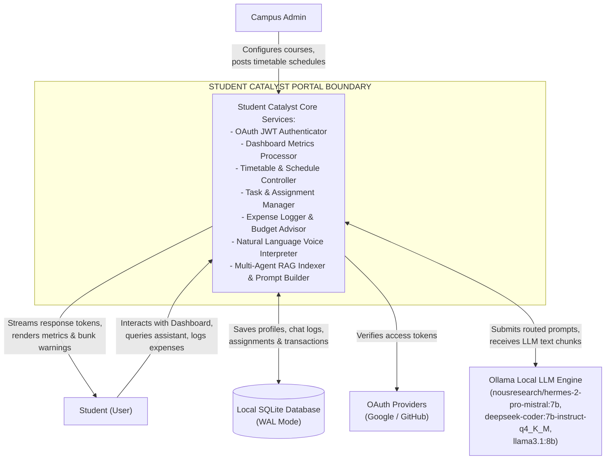
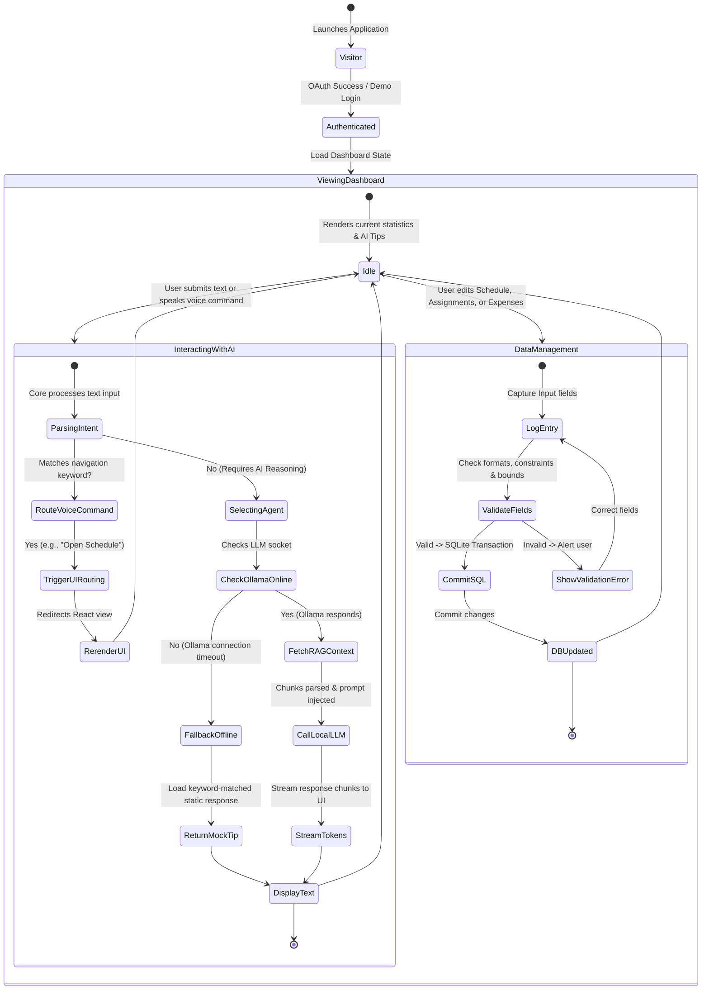
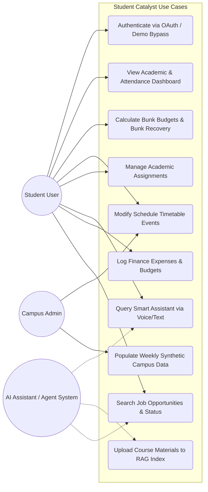
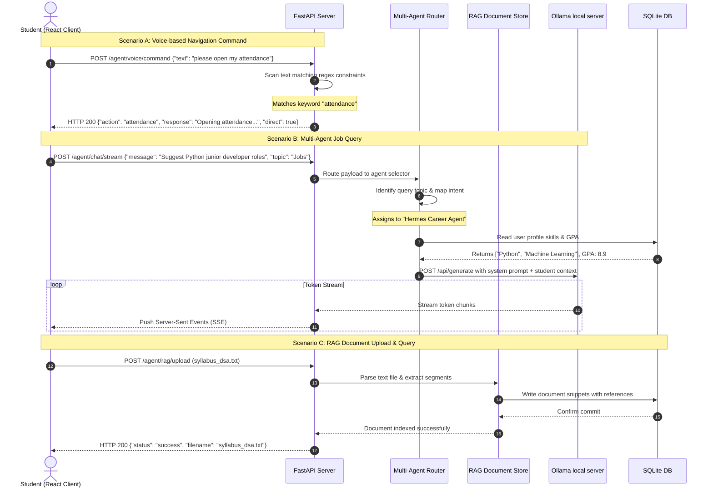
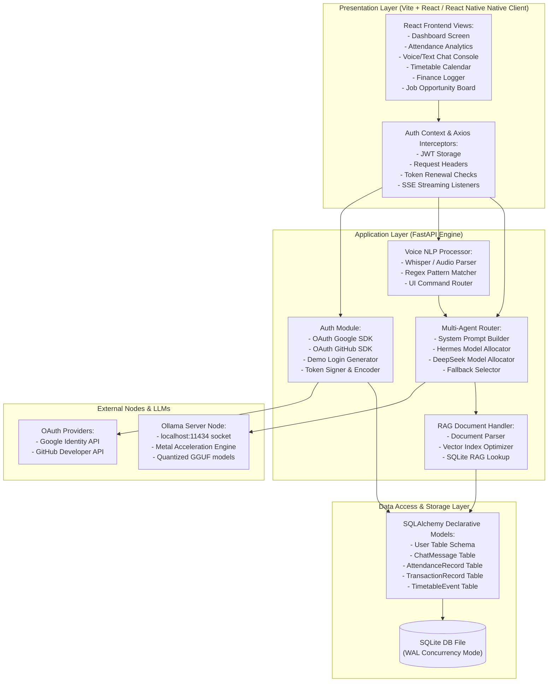
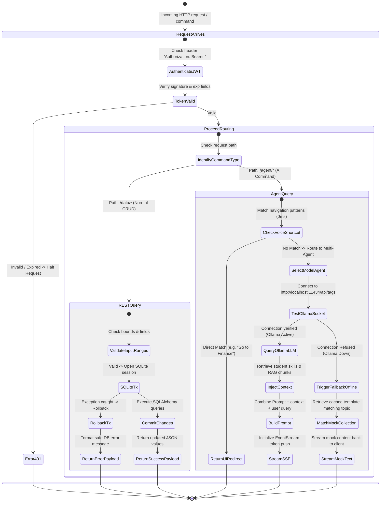
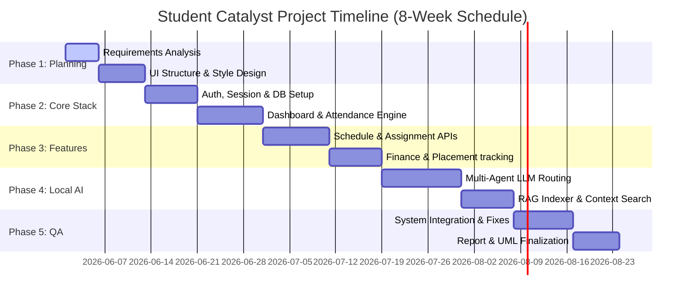

# VISVESVARAYA TECHNOLOGICAL UNIVERSITY, BELAGAVI 590018

<p align="center">
  
</p>

## SE AAT Report on
# "Smart Campus Productivity Dashboard & Multi-Agent Assistant — STUDENT CATALYST"

### By
* **Anish Balabattuni (1WN24CS039)**
* **Anish Saranath (1WN24CS041)**
* **Anitej Padyana (1WN24CS042)**
* **Arushi Kumari (1WN24CS051)**

### Under the Guidance of
**M LAKSHMI NEELIMA**  
*Assistant Professor, Department of CSE*  
**BMS College of Engineering**

---

### SE AAT Report carried out at
**Department of Computer Science and Engineering**  
**BMS College of Engineering**  
*(Autonomous college under VTU)*  
*P.O. Box No.: 1908, Bull Temple Road, Bangalore-560 019*  
**2025-2026**

---

## TABLE OF CONTENTS
1. [TITLE OF THE PROJECT/PRODUCT](#1-title-of-the-projectproduct)
2. [INTRODUCTION](#2-introduction)
3. [SOFTWARE REQUIREMENT SPECIFICATION (SRS)](#3-software-requirement-specification-srs)
    - 3.1 [Problem Statement](#31-problem-statement)
    - 3.2 [User Requirements](#32-user-requirements)
    - 3.3 [System Requirements](#33-system-requirements)
    - 3.4 [Domain Requirements](#34-domain-requirements)
4. [DESIGN MODELS](#4-design-models)
    - 4.1 [Context Model](#41-context-model)
    - 4.2 [State Model](#42-state-model)
    - 4.3 [Use-case Model](#43-use-case-model)
    - 4.4 [Sequence Model](#44-sequence-model)
5. [DETAILED DESCRIPTION OF MODELS](#5-detailed-description-of-models)
    - 5.1 [Context Model Description](#51-context-model-description)
    - 5.2 [State Model Description](#52-state-model-description)
    - 5.3 [Use-case Model Description](#53-use-case-model-description)
    - 5.4 [Sequence Model Description](#54-sequence-model-description)
6. [ARCHITECTURAL DESIGN](#6-architectural-design)
    - 6.1 [Structural Model](#61-structural-model)
    - 6.2 [Control Model](#62-control-model)
7. [DETAILED DESIGN](#7-detailed-design)
    - 7.1 [Module Design](#71-module-design)
    - 7.2 [Database Design](#72-database-design)
    - 7.3 [API and Process Design](#73-api-and-process-design)
    - 7.4 [Key Validation Rules](#74-key-validation-rules)
8. [ESTIMATION AND SCHEDULE](#8-estimation-and-schedule)
    - 8.1 [Estimation Technique 1: Use Case Point (UCP)](#81-estimation-technique-1-use-case-point-ucp)
    - 8.2 [Estimation Technique 2: Bottom-up Work Breakdown](#82-estimation-technique-2-bottom-up-work-breakdown)
    - 8.3 [Time Line Chart](#83-time-line-chart)
9. [TEST CASES](#9-test-cases)
10. [CONCLUSION](#10-conclusion)

---

## 1. TITLE OF THE PROJECT/PRODUCT

### STUDENT CATALYST
**Smart Campus Productivity Dashboard & Multi-Agent Assistant**

| Metadata Attribute | Project Details |
| :--- | :--- |
| **Application Type** | Multi-role responsive desktop & mobile MVP dashboard integrated with a local, multi-agent AI assistant orchestrator. |
| **Primary Stack** | React (Vite + Tailwind CSS v4 + TypeScript), FastAPI (Python 3 + SQLAlchemy ORM), SQLite (WAL Concurrency Mode), Expo (React Native for Mobile App), Ollama local LLM model engine (`deepseek-coder:7b`, `nousresearch/hermes-2-pro-mistral:7b`, `llama3.1:8b`). |
| **Core Roles** | Student User (Participant), Campus Administrator (Manager), AI Assistant (Hermes Multi-Agent Suite). |
| **Deployment Targets** | macOS Backend Local Instance (M1/M2/M3 Metal Acceleration), Render/Vercel (Backend), Cloudflare Pages (Frontend Web UI), and Expo Go (Mobile App Client). |

---

## 2. INTRODUCTION

**Student Catalyst** is a full-stack campus productivity suite and intelligent assistant designed to aggregate the scattered digital workflows of college students. In typical academic settings, students are required to navigate separate, isolated applications for attendance tracking, exam timetables, assignment priorities, internship placement statistics, budget plans, and travel schedules. This fragmentation increases student cognitive overload, leads to critical missed deadlines, and impedes proactive academic decision-making.

By unifying these tools under a single dashboard, Student Catalyst allows students to view their key metrics instantly. Additionally, the application integrates a **Local Multi-Agent Large Language Model (LLM)** engine running via Ollama. It features specialized agents (such as **Hermes** for research/jobs and **DeepSeek-Coder** for coding queries) to provide natural-language answers, automated email drafts, homework help, and voice-command navigation. 

Crucially, the application operates with a multi-layered fallback strategy. If local hardware acceleration (e.g., Apple Metal GPU execution) is unavailable or the local LLM server is offline, the backend degrades gracefully to 0ms-latency keyword matching and pre-cached expert responses. This ensures that core productivity services—such as VTU 75% attendance calculations, safe bunk thresholds, and assignment lists—remain operational at all times.

---

## 3. SOFTWARE REQUIREMENT SPECIFICATION (SRS)

### 3.1 Problem Statement
The modern university experience is highly fragmented. Student scheduling, syllabus files, and financial planning are distributed across web portals, shared spreadsheets, and message boards. Students lack a unified, context-aware interface that tracks:
1. **Attendance Recovery**: Knowing exactly how many classes they can safely skip (bunk) or must attend to stay above the 75% VTU statutory minimum.
2. **Task Prioritization**: Merging homework assignments with calendar dates, prioritizing them by urgency.
3. **Career Portals**: Tracking internship applications, interview cycles, and placement conversions.
4. **Intelligent Assistance**: Resolving queries and navigating the application through voice and text commands without requiring high-latency external cloud connections.

### 3.2 User Requirements
* **Student Dashboard**: Students must see their CGPA, earned credits, today's timetable, and overall attendance on a consolidated page.
* **Attendance Budgets**: Students must view subject-by-subject attendance percentages with alert states (Safe/Warning/Danger) and real-time safe bunk counts.
* **Assignment Tracking**: Students must be able to add, modify, and delete assignments, categorize them by type, and mark them as complete.
* **Assistant Integration**: Students must be able to interact with the dashboard using natural language voice commands (e.g., "Show my assignments" or "Find cab routes") or text queries.
* **Budget Planning**: Students must track monthly expenditures against a set limit and receive AI savings recommendations.
* **Local Offline Fallback**: The app must remain responsive even when local LLM server infrastructure is stopped or loading.

### 3.3 System Requirements

#### Functional Requirements
* **OAuth Authentication**: The system shall authenticate users via Google and GitHub OAuth, or permit a fast local demo bypass.
* **Session Management**: The system shall issue and verify JSON Web Tokens (JWT) for secure, role-based route control.
* **Dynamic Timetable CRUD**: The system shall support CRUD operations on student weekly timetables, mapping subjects to classrooms, timings, and professors.
* **Attendance Analysis Engine**: The system shall compute overall attendance progress and safe bunk margins using current SQLite statistics.
* **Multi-Agent Rerouting**: The system shall parse incoming chat prompts and dynamically delegate them to specialized LLMs (Hermes for research/jobs, DeepSeek for code) based on user intent.
* **RAG Document Indexing**: The system shall allow students to upload text documents (e.g., syllabus, class notes) and perform contextual queries using locally cached text snippets.
* **Voice Command NLP Interpreter**: The system shall transcribe audio files and translate natural language text into UI routing commands (e.g., navigate to attendance page).
* **Synthetic Data Generation**: The system shall seed initial database tables with consistent, context-appropriate data relative to the current calendar week.
* **Streaming Responses**: The system shall stream generated agent responses token-by-token back to the React front-end client using EventStream protocols.

#### Non-Functional Requirements
* **Performance**: Direct voice commands and keyword searches must resolve under 50ms. LLM-routed queries on Apple M-Series GPUs must deliver the first token under 2 seconds.
* **Reliability**: SQLite transactions must operate under Write-Ahead Logging (WAL) and synchronous normal pragma to support concurrent dashboard reads and edits without locks.
* **Security**: All API routes (except auth and health) must mandate JWT token transmission in headers.
* **Privacy**: RAG processing and LLM inferences must run completely local on the user's host Mac without sending document snippets to external cloud servers.

### 3.4 Domain Requirements
* **The 75% Rule**: Under VTU regulations, any course attendance dropping below 75% triggers a "Danger" warning state.
* **Safe Bunk Formula**: The margin of safety is calculated as:
  $$\text{Safe Bunks} = \max\left(0, \text{Attended} - \lfloor 0.75 \times \text{Total} \rfloor\right)$$
  If the current ratio is below 75%, the bunk margin is zero, and the system instead calculates the number of consecutive classes the student must attend to recover.
* **Placement Status Machine**: Career applications move through discrete stages (`Applied` $\rightarrow$ `OA` $\rightarrow$ `Technical Round` $\rightarrow$ `HR Round` $\rightarrow$ `Offer` / `Rejected`).
* **Model Separation**: Coding queries require compiler/syntax knowledge, while job matching requires profile skill-parsing. The system must prevent mixing these contexts.

---

## 4. DESIGN MODELS

### 4.1 Context Model

The Context Model outlines the boundary of the Student Catalyst system and its interfaces with actors, storage models, and local model infrastructure.



---

### 4.2 State Model

The State Model maps the lifecycle states of a student's session and interaction with the intelligent assistant and database managers.



---

### 4.3 Use-case Model

The Use-case Model represents the relationships between Student Users, Admins, the AI Assistant, and various system functions.



---

### 4.4 Sequence Model

The Sequence Model details the asynchronous communication protocol between the client front-end, FastAPI backend, local database, RAG processor, and Ollama LLM node.



---

## 5. DETAILED DESCRIPTION OF MODELS

### 5.1 Context Model Description
The Context Model (Section 4.1) establishes Student Catalyst as a local hub. The center of the system is the FastAPI gateway which orchestrates incoming actions. The gateway uses Google and GitHub OAuth to establish authenticated sessions. 

The storage boundary is defined by a local SQLite database file operating in Write-Ahead Log (WAL) mode. This configuration allows concurrent read operations by UI components and AI search scripts without causing write-blocking database lock conflicts. 

For AI reasoning, the gateway connects to the local Ollama socket at `http://localhost:11434`. It routes prompts to the correct models depending on the domain context, keeping all student records, chat logs, and uploaded files on the local machine.

### 5.2 State Model Description
The State Model (Section 4.2) details the transitions of the application. The system initializes in a `Visitor` state before moving to an `Authenticated` state. The dashboard remains in the `ViewingDashboard` state while rendering user data. 

When a student queries the assistant or speaks a voice command, the system enters the `InteractingWithAI` state. The FastAPI backend processes the request to identify routing actions. If a simple navigation match occurs (e.g., "go to jobs"), the frontend executes a route redirect, bypassing the LLM. 

If the query requires natural language processing, the system connects to Ollama. If the connection is successful, the query is combined with RAG text chunks and student skills, and the system transitions to `StreamTokens`. If Ollama is unreachable, the system triggers the `FallbackOffline` state and returns cached text templates.

### 5.3 Use-case Model Description
The Use-case Model (Section 4.3) isolates user roles and system operations. The **Student User** is the primary actor, interacting with use cases like tracking assignments, viewing attendance metrics, checking bunk budgets, logging expenses, and searching jobs. 

The **Campus Admin** represents administrative operations, interacting with schedule configurations and database seeding. 

The **AI Assistant** is an active background actor. It reads system variables, queries the SQLite RAG tables, parses syllabus files, and assists the Student User in executing natural language queries.

### 5.4 Sequence Model Description
The Sequence Model (Section 4.4) details three asynchronous communication processes:
1. **Scenario A (Direct Voice Command)**: The student requests page navigation using voice. The FastAPI backend uses keyword mapping to resolve the target destination and returns UI routing events instantly.
2. **Scenario B (Smart Agent Chat)**: The student asks a career question. The multi-agent system identifies the "Jobs" topic, selects the **Hermes** model, retrieves the student's skills from SQLite, and streams the generated response.
3. **Scenario C (RAG Document Store)**: The student uploads a text document. The backend splits the document into text chunks, records them in SQLite, and returns an index confirmation code.

---

## 6. ARCHITECTURAL DESIGN

### 6.1 Structural Model

The Structural Model represents the tiered organization of components. It separates user interface components from business logic validation engines and physical SQLite storage structures.



---

### 6.2 Control Model

The Control Model describes how the system validates requests, resolves user permissions, handles local LLM states, and handles errors at runtime.



---

## 7. DETAILED DESIGN

### 7.1 Module Design

* **Authentication and User Session Module**: Manages student identity through JWT verification. Contains helpers to exchange tokens with Google and GitHub, alongside a local mock bypass to generate valid test sessions for offline development.
* **Student Dashboard Module**: Aggregates academic and financial metrics. Reads from SQLAlchemy tables to output GPA, credits, attendance states, today's schedule events, and priority tasks.
* **Attendance Tracking Module**: Implements the core attendance rules. It monitors attended versus skipped lectures, categorizing course attendance into three colored states:
  * **Safe** (Green): Attendance $\ge 85\%$
  * **Warning** (Yellow): $75\% \le \text{Attendance} < 85\%$
  * **Danger** (Red): Attendance $< 75\%$
* **Multi-Agent AI Chat Module**: An routing script that selects the appropriate local model depending on query text. The router selects **DeepSeek-Coder** for code queries and **Hermes** for internship research and general questions.
* **RAG Document Service Module**: Parses text uploads, splits documents into segments, and stores them in the database. During RAG queries, it pulls relevant snippets to inject into the LLM context.
* **Timetable Scheduler Module**: Manages weekly classroom schedules, subject rooms, faculty assignments, and cancellation flags.
* **Finance Tracker Module**: Logs student expenditures, maps them to categories (Food, Travel, Books), and monitors spending against the student's monthly budget.
* **Career and Placement Tracker Module**: Tracks internship roles, company deadlines, and application phases, displaying conversion analytics to the student.
* **Assignment Manager Module**: Organizes homework tasks by deadline and priority.

### 7.2 Database Design

The local SQLite schema consists of the following database tables:

#### Table 1: `users`
| Column Name | Data Type | Key Type | Nullability | Description |
| :--- | :--- | :--- | :--- | :--- |
| `id` | INTEGER | Primary Key | NOT NULL | Unique student identifier |
| `oauth_id` | VARCHAR | Unique Index| NOT NULL | OAuth identifier from Google/GitHub |
| `email` | VARCHAR | Unique Index| NOT NULL | Student institutional email address |
| `name` | VARCHAR | - | NOT NULL | Display name of the student |
| `avatar_url` | VARCHAR | - | NULL | Profile image link |
| `major` | VARCHAR | - | NULL | Academic major |
| `gpa` | FLOAT | - | NULL | Current Cumulative GPA |
| `skills` | JSON | - | NULL | Array of skill strings (e.g. Python, SQL) |
| `experience` | TEXT | - | NULL | Text description of student history |
| `preferences` | JSON | - | NULL | UI settings (e.g., dark mode, notifications)|
| `is_new` | BOOLEAN | - | NOT NULL | Flags new users for onboarding walkthroughs |
| `created_at` | DATETIME | - | NOT NULL | Record creation timestamp |
| `last_login` | DATETIME | - | NOT NULL | Last connection timestamp |

#### Table 2: `chat_messages`
| Column Name | Data Type | Key Type | Nullability | Description |
| :--- | :--- | :--- | :--- | :--- |
| `id` | INTEGER | Primary Key | NOT NULL | Unique message identifier |
| `user_id` | INTEGER | Foreign Key | NOT NULL | Reference to `users.id` |
| `topic` | VARCHAR | - | NULL | Chat topic context |
| `user_message` | TEXT | - | NOT NULL | Query input text |
| `ai_response` | TEXT | - | NOT NULL | Output response text |
| `created_at` | DATETIME | - | NOT NULL | Time message was processed |

#### Table 3: `mvp_course_attendance`
| Column Name | Data Type | Key Type | Nullability | Description |
| :--- | :--- | :--- | :--- | :--- |
| `id` | INTEGER | Primary Key | NOT NULL | Record ID |
| `user_id` | INTEGER | Foreign Key | NOT NULL | Reference to `users.id` |
| `subject` | VARCHAR | - | NOT NULL | Name of the course |
| `code` | VARCHAR | - | NOT NULL | Course code |
| `professor` | VARCHAR | - | NOT NULL | Name of the instructor |
| `attended` | INTEGER | - | NOT NULL | Number of classes attended |
| `total` | INTEGER | - | NOT NULL | Total number of classes conducted |

#### Table 4: `transactions`
| Column Name | Data Type | Key Type | Nullability | Description |
| :--- | :--- | :--- | :--- | :--- |
| `id` | INTEGER | Primary Key | NOT NULL | Transaction identifier |
| `user_id` | INTEGER | Foreign Key | NOT NULL | Reference to `users.id` |
| `category` | VARCHAR | - | NOT NULL | Spending category (Food, Travel, etc.) |
| `amount` | FLOAT | - | NOT NULL | Amount spent |
| `date` | DATETIME | - | NOT NULL | Transaction date |
| `description` | VARCHAR | - | NULL | Custom transaction details |

#### Table 5: `mvp_assignments`
| Column Name | Data Type | Key Type | Nullability | Description |
| :--- | :--- | :--- | :--- | :--- |
| `id` | INTEGER | Primary Key | NOT NULL | Assignment ID |
| `user_id` | INTEGER | Foreign Key | NOT NULL | Reference to `users.id` |
| `title` | VARCHAR | - | NOT NULL | Assignment title |
| `subject` | VARCHAR | - | NOT NULL | Associated course name |
| `type` | VARCHAR | - | NOT NULL | Category (coding, lab, written) |
| `priority` | VARCHAR | - | NOT NULL | Priority level (low, medium, high) |
| `status` | VARCHAR | - | NOT NULL | State (pending, complete) |
| `due_at` | DATETIME | - | NOT NULL | Completion deadline |

#### Table 6: `mvp_schedule_events`
| Column Name | Data Type | Key Type | Nullability | Description |
| :--- | :--- | :--- | :--- | :--- |
| `id` | INTEGER | Primary Key | NOT NULL | Schedule event ID |
| `user_id` | INTEGER | Foreign Key | NOT NULL | Reference to `users.id` |
| `day` | VARCHAR | - | NOT NULL | Short day representation (Mon, Tue) |
| `date` | VARCHAR | - | NOT NULL | ISO date string |
| `subject` | VARCHAR | - | NOT NULL | Subject name |
| `start_time` | VARCHAR | - | NOT NULL | Class start time |
| `end_time` | VARCHAR | - | NOT NULL | Class end time |
| `room` | VARCHAR | - | NULL | Room location |
| `faculty` | VARCHAR | - | NULL | Instructor name |
| `status` | VARCHAR | - | NOT NULL | State (scheduled, cancelled) |

---

### 7.3 API and Process Design

The REST API is built using FastAPI. Key endpoints include:

```
[Student React client] 
       │
       ├── GET  /user/profile  ───────────► [Read Profile details]
       ├── GET  /data/dashboard ──────────► [Calculate CGPA, Credits, Alerts]
       ├── GET  /data/attendance ─────────► [Retrieve Course Bunk Budgets]
       ├── GET  /data/schedule ───────────► [Get Weekly Timetable Classes]
       ├── GET  /data/assignments ────────► [List Pending Academic Tasks]
       ├── GET  /data/finance ────────────► [Check Expenditure Transactions]
       ├── GET  /data/jobs ───────────────► [Match Job Listings by Skills]
       │
       ├── POST /agent/voice/command ─────► [Natural Language Voice Parser]
       ├── POST /agent/chat/stream ───────► [Multi-Agent SSE LLM Generator]
       └── POST /agent/rag/upload ────────► [Process Document text chunks]
```

#### RAG Document Query Flow:
1. **Upload**: A POST request to `/agent/rag/upload` takes a text file, splits it into paragraph chunks, and saves the text segments to the local database.
2. **Context Search**: When a chat request is processed, the system searches the stored segments for matches against the query.
3. **Prompt Enrichment**: Matching text segments are prepended to the system prompt as reference material, allowing Ollama to answer questions using the uploaded document's context.

---

### 7.4 Key Validation Rules

* **VTU Minimum Attendance Requirement**:
  * $\text{Overall Percentage} \ge 85\% \implies$ **Safe**
  * $75\% \le \text{Overall Percentage} < 85\% \implies$ **Warning**
  * $\text{Overall Percentage} < 75\% \implies$ **Danger** (requires bunk recovery)
* **Safe Bunk Calculations**:
  If the student's current percentage is $\ge 75\%$, the budget calculates how many classes they can skip without falling below the threshold:
  $$\text{Safe Bunks} = \text{Attended} - \lceil 0.75 \times \text{Total} \rceil$$
  If the current percentage is $< 75\%$, the budget is 0, and the recovery algorithm calculates the number of consecutive classes they must attend to restore their percentage:
  $$\text{Required Classes} = \lceil 3 \times \text{Total} - 4 \times \text{Attended} \rceil$$
* **Multi-Agent Selection Rules**:
  * If query contains code patterns, program keywords, or coding requests: route to **DeepSeek-Coder** system prompt.
  * If query contains company research, placement metrics, mock interviews, or resume questions: route to **Hermes-2-Pro** system prompt.
  * Otherwise: route to **Llama** or **Mistral** for general chat.
* **Financial Budget Rules**:
  * Maximum monthly budget constraint: ₹7,000.
  * Transactions that exceed the remaining balance trigger an immediate warning in the response payload.

---

## 8. ESTIMATION AND SCHEDULE

### 8.1 Estimation Technique 1: Use Case Point (UCP)

To estimate project scope size, the UCP technique weights actors and use case complexities.

#### 1. Actor Weights (UAW)
| Actor Type | Description | Weight | Count | Score |
| :--- | :--- | :---: | :---: | :---: |
| **Complex** | Interactive React client & Multi-Agent router. | 3 | 3 | 9 |
| **Average** | External Google / GitHub OAuth callback APIs. | 2 | 2 | 4 |
| **Total Actor Weight (UAW)** | | | | **13** |

#### 2. Use Case Weights (UUCW)
| Use Case | Complexity | Weight | Count | Score |
| :--- | :--- | :---: | :---: | :---: |
| OAuth login & demo profile settings | Simple | 5 | 1 | 5 |
| Dashboard analytics, GPA, credits aggregation | Average | 10 | 1 | 10 |
| Attendance tracking & safe bunk computation | Average | 10 | 1 | 10 |
| Timetable planner CRUD | Average | 10 | 1 | 10 |
| Assignment prioritization manager | Average | 10 | 1 | 10 |
| Smart voice command regex shortcut router | Average | 10 | 1 | 10 |
| Expense logger & budget tracker | Average | 10 | 1 | 10 |
| Placement pipeline & jobs scraper | Average | 10 | 1 | 10 |
| local Ollama multi-agent setup & streaming | Complex | 15 | 1 | 15 |
| RAG document vector splitter & search index | Complex | 15 | 1 | 15 |
| **Total Use Case Weight (UUCW)** | | | | **95** |

#### 3. Unadjusted Use Case Points (UUCP)
$$\text{UUCP} = \text{UAW} + \text{UUCW} = 13 + 95 = 108$$

#### 4. Project Sizing
* **Technical Complexity Factor (TCF)**: Calculated as **0.95** due to real-time audio parsing, streaming response endpoints, and local GPU acceleration integrations.
* **Environmental Complexity Factor (ECF)**: Calculated as **0.88** based on standard developer experience and existing framework capabilities.
* **Adjusted Use Case Points (UCP)**:
  $$\text{UCP} = \text{UUCP} \times \text{TCF} \times \text{ECF} = 108 \times 0.95 \times 0.88 = 90.288$$
* **Effort Sizing**: Using a prototype productivity factor of 8 person-hours per Use Case Point:
  $$\text{Effort} = 90.288 \text{ UCP} \times 8 \text{ hours/UCP} \approx 722 \text{ person-hours}$$

---

### 8.2 Estimation Technique 2: Bottom-up Work Breakdown

The bottom-up estimation aggregates time estimates for individual implementation modules.

| Work Package Component | Estimated Days | Owner Focus |
| :--- | :---: | :--- |
| Requirements analysis, architecture definition, database design | 5 | All |
| Frontend navigation structure, styles configuration | 7 | Frontend |
| OAuth integrations, token management | 8 | Backend |
| Dashboard aggregation, attendance budget endpoints | 10 | Backend |
| Schedule CRUD and assignment manager API interfaces | 10 | Backend |
| Jobs board, placement statistics tracker | 8 | Full Stack |
| Local Ollama orchestrator, agent selection, token stream | 12 | Backend / AI |
| RAG file indexer, SQLite search integration | 8 | Backend / AI |
| Integration verification, performance testing, bug fixes | 9 | All |
| Report creation, UML diagram compilation | 7 | All |
| **Total Estimated Effort** | **84** | **84 person-days** |

With a 4-member student team working in parallel, the estimated calendar schedule is approximately **3.5 to 4 weeks**.

---

### 8.3 Time Line Chart

The development schedule is organized across an 8-week timeline:



---

## 9. TEST CASES

The test suite covers user authorization, dashboard analytics, attendance warnings, local AI agent routing, RAG text processing, and fallback behaviors.

| ID | Test Scenario | Input / Precondition | Expected Output / Result |
| :--- | :--- | :--- | :--- |
| **TC-01** | Demo Login Bypass | POST request to `/auth/demo` with test email address. | Creates user profile in SQLite and returns valid JWT access token. |
| **TC-02** | Google Token Auth | POST request to `/auth/google` containing token payload. | Validates token against OAuth API and returns authenticated user session. |
| **TC-03** | Dashboard Analytics aggregation | GET request to `/data/dashboard` with active JWT. | Returns current CGPA, total credits, upcoming tasks, and weekly classes. |
| **TC-04** | Attendance safe bunk calculation | GET request to `/data/attendance` with database course metrics. | Calculates safe skip counts and highlights status (Safe/Warning/Danger). |
| **TC-05** | CRUD Timetable modification | PUT request to `/data/schedule/{id}` with new class room details. | Saves updated schedule details and resolves scheduling conflicts. |
| **TC-06** | Task Priority tracking | POST request to `/data/assignments` with high-urgency task. | Creates assignment, lists by deadline, and sets priority to high. |
| **TC-07** | Budget limit check | POST request to `/data/finance` with transaction exceeding monthly budget. | Saves transaction and returns budget alert in response. |
| **TC-08** | Job matching filtering | GET request to `/data/jobs` with keyword "Python". | Returns relevant job openings that match the student's profile skills. |
| **TC-09** | Basic voice navigation shortcut | POST request to `/agent/voice/command` with text "Open timetable". | Returns HTTP 200 with direct routing action for timetable view. |
| **TC-10** | Voice query agent selection | POST request to `/agent/voice/command` with text "Find coding roles". | Identifies query intent and routes to Hermes Career Agent. |
| **TC-11** | RAG Document processing | POST request to `/agent/rag/upload` containing course text file. | Parses text file, splits into segments, and saves to database. |
| **TC-12** | Contextual RAG search chat | POST request to `/agent/chat/stream` with question about uploaded document. | Retrieves relevant text segments, passes to LLM, and streams answer. |
| **TC-13** | Local LLM fallback behavior | POST request to `/agent/chat/stream` when Ollama server is offline. | LLM client catches connection error and returns a pre-cached mock response. |
| **TC-14** | Get RAG indexed documents listing | GET request to `/agent/rag/documents` with valid JWT. | Returns list of filenames and sizes of all indexed RAG documents. |
| **TC-15** | Delete RAG indexed document | DELETE request to `/agent/rag/document/{filename}`. | Removes text segments from DB index and deletes references (HTTP 200). |
| **TC-16** | Add new schedule timetable event | POST request to `/data/schedule` with timetable event JSON body. | Stores schedule event in DB and returns the generated class ID. |
| **TC-17** | Delete schedule event | DELETE request to `/data/schedule/{id}`. | Removes target event from DB schedule, returns status success. |
| **TC-18** | Complete assignment status toggle | PUT request to `/data/assignments/{id}` with status "completed". | Marks assignment task complete, removing it from pending priorities. |
| **TC-19** | Delete assignment record | DELETE request to `/data/assignments/{id}`. | Deletes assignment entry from DB, returns success confirmation. |
| **TC-20** | Log manual attendance update | POST request to `/data/attendance` with course code and status. | Increments attended/total lectures fields and updates warnings. |
| **TC-21** | Configure monthly expenditure limit | POST request to `/data/finance/budget` with amount payload. | Updates user spending constraints, returning updated budget calculations. |
| **TC-22** | Edit financial transaction entry | PUT request to `/data/finance/{id}` with modified spending values. | Updates transaction details, recalculating category breakdown. |
| **TC-23** | Delete financial transaction | DELETE request to `/data/finance/{id}`. | Removes expense, restoring monthly budget remaining balance. |
| **TC-24** | Voice speech transcription | POST request to `/agent/voice/transcribe` with WAV audio file. | Transcribes speech using text parser and returns transcribing string. |
| **TC-25** | Fetch historical chat logs | GET request to `/agent/chat/history` with valid token. | Returns chronological query and response records from `chat_messages`. |

---

## 10. CONCLUSION

**Student Catalyst** provides a unified academic dashboard and offline AI assistant for university students. By centralizing key variables—such as attendance percentage tracking, assignment priority lists, career placement pipelines, expense budgets, and weekly timetables—it helps students manage their academic responsibilities.

From a software engineering perspective, the project demonstrates structured implementation practices. The application separates concerns between a React/Expo user interface, a FastAPI backend, and local storage. By using local LLM integration via Ollama, it provides specialized AI agents without requiring external cloud connections. The multi-layered fallback strategy ensures that core dashboard utilities remain operational even if local hardware acceleration is offline. This report aligns the project's technical architecture, database schemas, API routes, UML diagrams, development schedule, and test procedures with standard software engineering practices.
